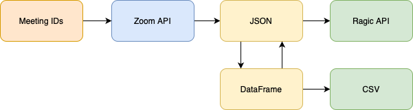

# Zoom Reporting

Automate Zoom attendance reports with Python.

## Quickstart Guide

1. Store API credentials in `.env`

2. Store meeting IDs in `assets/meeting_id.txt`

3. [Install poetry][1]

4. Install dependencies with `poetry install`

5. Run the script with `poetry run report -a`

## References

[Kickstart][2]

[Medium article][3]

[Using Zoom APIs][4]

[Ragic HTTP API Integration Guide][5]

[Blazing fast CI with GitHub Actions, Poetry, Black and Pytest][6]

[1]: https://python-poetry.org/docs/#installation
[2]: https://github.com/mattcoding4days/kickstart
[3]: https://medium.com/swlh/how-i-automate-my-church-organisations-zoom-meeting-attendance-reporting-with-python-419dfe7da58c
[4]: https://marketplace.zoom.us/docs/api-reference/using-zoom-apis
[5]: https://www.ragic.com/intl/en/doc-api
[6]: https://medium.com/@vanflymen/blazing-fast-ci-with-github-actions-poetry-black-and-pytest-9e74299dd4a5
